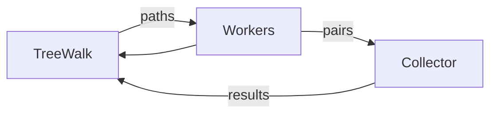

Goals of go

-   simplicity, safety, readability
-   ease of expressing algorithms
-   orthogonality
-   one right way to do things

### 00 - Intro and Why Use Go?

Easy to deploy - put a go program in container and good to go.

### 01 - Hello world!

### 02 - Simple Example

### 03 - Basic Types

In go there are only 25 keywords!

In an intepretive lang like Python, when you do `a = 2`, a is an obj that
represents or masquerades as a number in the interpreter - eventually the
interpreter (program written in C) will use the underlying hardware to actually
do math - needs to turn it into binary numbers at some point.

`a = 2 -> a object -> interpreter -> cpu -> ram	`

in Go, when we do `a := 2`, a is purely the address of a memory location in
the machine. - no interpreter, no JVM - it's direct.

`int` is the default type for integers in Go.

-   non ints are represented in floating point:
    `float32 float64`

> Don't use floating point for monetary calculations - use pkg like `go money`

Simple declarations
`var a int`
`var (b = 2 f = 2.01)`
Only inside funcs:
`c := 2` - short declaration operator - declare var, gives it value implicitly.

```go
a := 2
b := 2.4
fmt.Printf("a: %8T %v\n", a, a)
fmt.Printf("b: %8T %[1]v\n", b)
```

[1] syntax reuses the prev arg. 8 is for spacing.

We can't assing int to float - have to type cast.

### Special types

-   Can't convert bool to integer - so can't do false to 0 or true to 1.
-   error - special type with one function, Error() - may be nil or non nil
-   pointers are physically addresses, logically opaque
    A pointer can be nil or non nil
    no pointer manipulation except through unsafe pkg

### inits

There are no uninitialised vars in go - either u do it or go will do it for u.

-   All numerical types get 0
-   bool gets false
-   string gets ""
-   Everything else gets `nil`

### constants

only numbers, strings, and booleans can be constants (immutables)
good to have immutable constants in a concurrent language.

### sample

can redirect nums into stdin
can pipe file into stdin

```
❯ go run . < nums.txt
The avg is 5.75
❯ cat nums.txt | go run .
The avg is 5.75

```

# 04 - Strings

rune is the go equivalent of a character (wide char) - int32
physically strings are the utf-8 encoding of unicode characters.

-   byte is a synonym for uint8
-   rune is a synonym for int32 for characters.
-   string: an immutable sequence of "characters"

    -   physically a sequence of bytes (utf-8 encoding)
    -   logically a sequence of (unicode) runesp

-   runes (characters are enclosed in single quotes: 'a')

```go
s := "élite"

fmt.Printf("%8T %[1]v\n", s)

// cast to sequence of runes
fmt.Printf("%8T %[1]v\n", []rune(s))
// this prints [233 108 105 116 101]
// ASCII chars fit itno 0 - 127, so when this gets encoded to UTF-8, there
// is an expansion

// cast to bytes - now there is one extra byte. 233 is represented by 2 bytes.
// that's just how UTF-8 encodes unicode
b := []byte(s)
fmt.Printf("%8T %[1]v\n", b)

// get the length too (6)
fmt.Printf("%8T %[1]v %d\n", b, len(b))

// len of s?
fmt.Printf("%8T %[1]v %d\n", s, len(s))

// So the length of a string is the length of the byte string that's
// necessary to encode the string in UTF-8
// Logically it's 5 chars, physically it's 6 bytes in UTF-8 encoding.

//! Len of string is num of bytes required to represent the unicode
// chars, not the number of unicode chars
```

`s:= "hello, world`
s is a "descriptor" - describes something, has a pointer in it. The pointer points
to the actual location in memory where the bytes are, and it has extra info
like length (num of bytes that make up the string).

-   no null byte at end of string
-   in go len of string is encoded in descriptor instead so we don't have to walk
    the string until the null byte to know it ended.

`hello := s[:5]` - this points to same bytes in memory, but has new descriptor
these strings are immutable so they can share storage
`world :=s[7:]` - sub string in s and reuses memory in s
`t := s` - t will be a new descriptor with pointer to same bytes and same length

`s := "the quick brown fox"`
`d := s[:4] + "slow" + s[9:]` - this points to some completely different memory.
`s[5] = 'a'` - we can't do this.
`s += "es"` - (copies) - new chunk of memory made. s points to this new chunk now.
original s still exists as other vars reference it so in can't pe garbage collected

`s = strings.ToUpper(s)` - new piece of memory, s points to this new memory.

# 05 - Arrays, Slices, and Maps

```go
[4]int // array
[]int // slice
map[string]int // map of string to int
```

### Arrays

-   arrays are not used a lot
-   they have a fixed size.
-   fixed at compile time
-   arrays are passed by value, so elements are copied
-   bytes copied physically. `d = b` - bytes copied.

### Slice

-   Slices have variable length, backed by some array.
-   Slices have a descriptor like string, and it points at some other memory

```go
var a []int	      // nil, no storage
var b = []int{1,2}    // initialized

a = append(a, 1)      // append to nil OK
b = append(b, 3)      // []int{1,2,3}

a = b		      // overwrites a (`b` descriptor gets copied into `a` descriptor)
		      // points at same bytes

d := make([]int, 5)   // []int{0,0,0,0,0}
e := a		      // same storage (alias) e and a descriptors are the same.
e[0] == b[0]	      // true
```

### off by one

Slices are indexed like [8:11]
(read as starting el and one past the ending el, so 11 - 8 = 3 els in slice) 8,9,10

-   Passed by reference, no copying, updating OK.

**Slice**

-   Variable length
-   Passed by reference
-   Not comparable
-   Cannot be used as map key
-   Has copy & append helpers
    Useful as function param

**Array**

-   Length fixed at compile time
-   Passed by value (copied)
-   Comparable (==)
-   Can be used as map key
    Useful as "pseudo" constants

```go
var w = [...]int{1,2,3}
var x = []int{0,0,0}

func do(a [3]int, b [int]) []int {
  a = b		  // syntax error
  a[0] = 4	  // w unchanged (bytes copied, changing just local var)
  b[0] = 3	  // x changes

  c := make([]int, 5)
  c[4] = 42
  copy(c,b)	  // copies only 3 els

  return c
}

y := do(w,x) // [1,2,3], [3,0,0] [3,0,0,42]
```

### Map

-   Maps are dictionaries, indexed by key, returing a value.
-   You can read from a nil map, but inserting will panic

```go
var m map[string]int // nil, no storage
p := make(map[string]int) // non-nil but empty

a := p["the"] // returns 0 (it's the "nil" value for int)
b := m["the"] // same thing as above

m["and"] = 1 // PANIC - nil map
m = p
m["and"]++    // OK, same map as p now
c := p["and"] // returns 1
```

m has no hash table behind it so trying to insert crashes.
m points to nothing
p points to some hash table

`m = p` copies p descriptor into m descriptor. m points to same hash table p point to

-   Maps are passed by reference, no copying, updating ok
-   The type for the key must have "==" and "!=" defined (not slices, maps, funcs)
    must
-   Maps can't be compared to one another; maps can only be compared to nil.

Can declare a map inline:

```go
var m = map[string]int{
  "and": 1,
  "the": 1,
  "or": 2,
}

var n map[string]int // nil
b := m == n // syntax error
c := n == nil // true
d := len(m) // 3
e := cap(m) // type mismatch (capacity)
```

Maps have a special two-result lookup function
The second var tells you if key was there

```go
p := map[string]int{}	// non-nil but empty

a := p["the"]	// return 0 but is it 0 cause key not in map, or value is 0???
b, ok := p["and"] // 0, false

p["the"]++
c, ok := p["the"] // 1, true

if w, ok := p["the"]; ok {
  // we know w is not the default value here
  // ...
}
```

**Making nil useful**
Nil is a type of zero - inicates the absence of something.
In go the builtins like `len, cap, range` are safe to use with nils.
Can get len on nil string, can read from a nil map, can loop over nil string etc.

> "Make the zero value useful" - Rob Pike.
> https://www.youtube.com/watch?v=ynoY2xz-F8s

Look at `word-sort` project

# 06 - Control Statements; Declarations & Types

-   if statements need brackets.
-   can start with short declaration or statement
    `if err := doSomething(); err != nil {}`

When using range

```go
for i := range myArray {
  fmt.Println(i, myArray[i])
}

VS

// here, we copy value out of array into v. Don't do this if value is big
// bad performance, use first version.
for i, v := range myArray {
  fmt.Println(i, v)
}
```

-   In go, map is based off a hash table - no order.

-   If something is capitalized in go, it's exported. If it's not, it's internal
    to the package.

-   Dependencies are tree structure list. Can't do cyclical dependencies.
    Move common deps to 3rd pkg, or eliminate.

**What makes a good package?**

-   A pkg should embed deep functionality behind a simple API.

```go
package os

func Create(name string) (*File, error)
func Open(name string) (*File, error)

func (f *File) Read(b []byte) (n int, err error)
func (f *File) Write(b []byte) (n int, err error)
func (f *File) Close() error
```

short declarations have some gotchas! (:=)

```go
func Bad(f *os.File, buf []byte) error {
  var err error

  for {
    n, err := f.Read(buf) // shadows err above
    if err != nil {
      break // causes return of WRONG value
    }

    foo(buf)
  }

  return err // will always be nil
}
```

-   Go uses named typing for non function user-declared types. Most other cases
    it's structure based typings (duck typing)

# 07 - Formatted & File I/O

Unix has the notion of 3 standard I/O streams:

-   standard input
-   standard output
-   standard error (output)

these are normally mapped to the console/terminal but can be redirected
`find . -name "*.go" | xargs grep -n "rintf" > print.txt`

```go
// Always os.Stdout
fmt.Println(...interface{}) (int, error)
fmt.Printf(string, ...interface{}) (int, error)

// Print to anything that has the correct Write() method
fmt.Fprintln(io.Writer, ...interface{}) (int, error)
fmt.Fprintf(io.Writer, string, ...interface{}) (int, error)

// Return a string
fmt.Sprintln(...interface{}) (int, error)
fmt.Sprintf(string, ...interface{}) (int, error)
```

In UNIX, a run of bytes is a file. Every file is just bytes.

# 08 - Functions, Parameters & Defer

Functions in Go are "first class" objects.

-   Define them, even inside other funct
-   Create anon func literals
-   Pass them as function parameters/return values
-   Store them in vars, slices, maps (not as keys), fields of a stuct type
-   Send and receive in channels
-   Write methods against a func type
-   Compare a func var against nil

The signature of a fn is the order & type of its params and return values.
It does not depend on the names of those params or returns.

A function declaration lists FORMAL parameters
`func do(a, b int) int {...}`

A function call has ACTUAL params (aka arguments)
`result := do(1, 2)`

A param is passed by VALUE if the func gets a copy. The caller can't see changes
to the copy

A param is passed by REFERENCE if the function can modify the actual param
such as that the caller sees the changes. Get the pointer to it.

By value: numbers, bool, arrays, structs
By reference: things passed by pointer (&x), strings (immutable), slices, maps, channels

```go
// Two different types of references

/*
Here the map descriptor gets copied, but we have reference to original hash table.
*/
func do(m1 map[int]int) {
	m1[3] = 0
	m1 = make(map[int]int)
	// m1 is a totally different map local to this fn.
	// No relation to m at all.
	m1[4] = 4
	fmt.Printf("m1: %v\n", m1)
}

/*
Here the ADDRESS of a map descriptor. We change map descriptor in this func,
as well as in main - it gets overwritten
*/
func doWithPointer(m1 *map[int]int) {
	// dereference pointer
	(*m1)[3] = 0
	(*m1) = make(map[int]int)
	(*m1)[4] = 4
	fmt.Printf("m1: %v\n", *m1)
}

func main() {
	m := map[int]int{4: 1, 7: 2, 8: 3}
	// do(m)
	// pass in address of m

	fmt.Printf("m: %v\n", m)
	doWithPointer(&m)
	fmt.Printf("m: %v\n", m)
}
```

-   So technically params are always passed in by value. (copying something)
-   If the thing copied is a pointer or descriptor, then the shared backing store
    (array, hash table, etc) can be changed through it.
-   So we think of it as a reference
-   Techically in go there's no such thing as by reference.
-   So that's why when we pass a pointer to a map descriptor (`doWithPointer`),
    if we change the map descriptor in other func, we change where it was called (main)

So the descriptors of slices, maps are copied, the underlying arrays/hash tables
are not.

### Defer

The `defer` statement captures a function call to run later.

-   operates on a function scope, not on a block scope. It will happen when func exits.

Don't always defer by default, for example if looping over filenames from `os.Args`,
you open a file, then defer `file.Close()` at end of each iteration, it won't
close it at end of iteration, but at end of func. So you might end up constantly
opening files and not closing, running out of memory.

Unlike a closure, `defer` copies arguments into defered call.

```go
func main() {
  a := 10
  defer fmt.Println(a)
  a = 11
  fmt.Println(a)
}
// prints 11, 10
```

The param `a` gets copied at the defer statement (not a reference)

```go
func do() (a int) {
  defer func() {
    a = 2
  }()

  a = 1
  return
}
// returns 2
```

# 09 - Closures

Fucs that live inside funcs and refer the enclosing funcs data.

**Scope vs lifetime**
Scope is static, based on the code at compile time.
Lifetime depends on program execution (runtime)
Lifetime of a var can exceed the scope in which it's declared

```go
func do() *int {
  var b int
  // ...
  return &b
}
```

ends up in heap

-   escape analysis
    Var b can only be seen inside `do`, but its value will live on.
    The value (object) will live so long as part of the program keeps a pointer to it.

In interpreted languages all allocations happen in the heap - not efficient.
Go allocates as much as possible in stack - when lifetime exceeds, then uses heap.

**What is a closure?**
When a func inside another func "closes over" one or more local variables of
the outer func.

```go
func fib() func() int {
  a, b := 0, 1

  return func() int {
    a, b = b, a + b
    return b
  }
}
```

The inner func gets a reference to the outer func's var
Those vars may end up with much longer lifetime than expected - as long as there's
a reference to the inner func.

Example with common misunderstanding
https://youtu.be/US3TGA-Dpqo?list=PLoILbKo9rG3skRCj37Kn5Zj803hhiuRK6

```go
s := make([]func(), 4)

for i := 0; i < 4; i++ {
	i := i // here's how to fix that issue - create local copy that cannot mutate again
	s[i] = func() {
		fmt.Printf("%d @ %p\n", i, &i)
	}
}

for i := 0; i < 4; i++ {
	s[i]()
}

// when we run this, we get same location and value for i - 4
// closure has a reference to i. So that's why it stays as 4 for all.
// so when we call closure, we always print 4 - they use the same i
```

# 10 - Slices in Detail

![[Pasted image 20231007112434.png]]
![[Pasted image 20231007112449.png]]
Why do we care?
![[Pasted image 20231007112636.png]]
When we check if slice is empty or not, the best way is
`if len(s) == 0 {}`
cause checking if `s == nil` , it can be nil in 2 cases - nil or empty slice.

> Common gotcha - creating a slice with 0 length and 5 capacity is all good, can do s[0] = "", and can `append`, but creating slice with len and cap 5 (`make([]int, 5)`) and `append` will add the new values after the 5 0s...

    It is also okay to append to a nil slice.

Another common gotcha is not using `d := a [0:1:1]` (slice with len and capacity.)
With 2 slicing operators, you get the capacity of original underlying array. Not intuitive
![[Pasted image 20231007120537.png]]

![[Pasted image 20231007120521.png]]

If we append first, we get new memory.

# 11 - Homework #2

Depth first search

# 12 - Structs, Struct tags & JSON

A struct is an aggregate, like a DB record.

```go
type Employee struct {
	Name   string
	Number int
	Boss   *Employee
	Hired  time.Time
}

func main() {
	// Always do maps of strings to struct POINTERS - issues otherwise (https://youtu.be/0m6iFd9N_CY?list=PLoILbKo9rG3skRCj37Kn5Zj803hhiuRK6&t=796)
	c := map[string]*Employee{}

	c["lamine"] = &Employee{"Lamine", 2, nil, time.Now()}

	c["matt"] = &Employee{
		Name:   "Matt",
		Number: 1,
		Hired:  time.Now(),
		Boss:   c["lamine"],
	}

	fmt.Printf("%T %+[1]v\n", c["lamine"])
	fmt.Printf("%T %+[1]v\n", c["matt"])
}
```

```go
func main() {
	var album1 = struct {
		title string
	}{
		"The white album",
	}
	var album2 = struct {
		title string
	}{
		"The black album",
	}

	// we can do this - duck typing
	album1 = album2
	fmt.Println(album2, album1)
}
```

```go
type album1 struct {
	title string
}

type album2 struct {
	title string
}

func main() {
	var a1 = album1{
		"The white album",
	}
	var a2 = album2{
		"The  black album",
	}

	// We can't do this - not the same named types.
	a1 = a2
	// They are convertible
	a1 = album1(a2)
	fmt.Println(a2, a1)
}
```

Two struct types are compatible if

-   fields have same types and names
-   in the same order
-   and the same tags (\*)

A struct may be copied or passed as a param in its entirety.
A struct is comparable if all its fields are comparable
The zero value for a stuct is "zero" for each field in turn.

**Passing structs**

```go
func soldAnother(a album) {
  // oops
  a.copies++
}
func soldAnother(a *album) {
  a.copies++
  // same as (*a).copies
}
```

`struct{}` is a singleton!

**Struct tags**

-   A string that's put at end of the field type and it has some info on how to
    encode the field in various protocols.
-   Usually used to convers data in the program to an external format, json, protobufs,
    dbs, xml
    Using reflection to encode and decode

```go
type Response struct {
	Page int `json:"page"`
	// if lowercase, not exported. Private fields of struct not encoded.
	Words []string `json:"words,omitempty"`
}

func main() {
	r := &Response{Page: 1, Words: []string{"up", "in", "out"}}
	j, _ := json.Marshal(r)
	fmt.Printf("j: %v\n", string(j))
	fmt.Printf("r: %#v\n", r)

	var r2 Response
	_ = json.Unmarshal(j, &r2)
	fmt.Printf("r2: %#v\n", r2)
}
```

# 13 - Regular Expressions & Search

// TODO later

# 14 - Reference & Value Semantics

When to use pointers vs when to use values?
**Pointers** - Shared, not copied
**Values** - Copied, not shared

Sometimes not sharing is safer (concurrency)
Pointer semantics _may_ be more efficient.

**Why use pointers?**

-   Some objs can't be copied safely (mutex)
-   Some objs are too large to copy efficiently (consider when size > 64 bytes)
-   Some methods need to change (mutate) the receiver (later!)
-   Decoding protocol data into an obj (JSON)
-   Using a pointer to signal a null obj.
    Remember, pointers have a cost too - two trips to memory instead of one.

Any struct with a mutex MUST be passed by reference.

Any small struct under 64 bytes probably should be copied.
For example passing around descriptors is done by value! they're small 16 or 24 bytes.

If a thing is to be shared, always pass a pointer.
![[Pasted image 20231008101229.png]]

-   Stack allocation is more efficient. Putting on stack means not using pointers.
-   Accessing a var directly is more efficient that following a pointer
-   Accessing a dense sequence of data is more efficient that spare data (array faster than linked list etc.)

-   Escape analysis - go figures out if to put stuff on stack or heap
    build with `-gcflags -m=2` to see.

For loop:

```go
for i, thing := range things {
	// thing is a copy
}

// Use index if you need to mutate element
for i, thing := range things {
	thing[i].foo = bar
}
```

Slice safety:
Anytime a func mutates a slice that's passed in, we must return a copy.

```go
func update(things []thing) []thing {
...
	things = append(things, x)
	return things
}
```

![[Pasted image 20231008103746.png]]

```go
items := [][2]byte{{1, 2}, {3, 4}, {5, 6}}
a := [][]byte{}

// WRONG!
for _, item := range items {
	// We are creating slice with same underlying array.
	// Effectively appending a slice that refernces the same memory location
	// as item.
	a = append(a, item[:])
}

// CORRECT
for _, item := range items {
	i := make([]byte, len(item))
	copy(i, item[:])
	a = append(a, i)
}

fmt.Printf("items: %v\n", items)

// by the time we print a, item has been updated to {5, 6} and all
// slices in 'a' refernce this same memory location
fmt.Printf("a: %v\n", a)
```

Another example
![[Pasted image 20231008105421.png]]

![[Pasted image 20231008105436.png]]

Common problems in closure, loop variables, goroutines.

# 15 - Networking with HTTP

![[Pasted image 20231008111618.png]]
Go doesn't have classes, but go allows methods to be put on any user
declared type.
Can put methods on a function - why not? it's just an objuct

# 16 - Homework #3

Two programs -

1. Read all comics into a file
2. Search those comics for a keyword

# 17 - Go does OOP

Essentials of OOP:

-   abstraction
-   encapsulation
-   polymorphism
-   inheritance

Sometimes the als two items are combined or confused.
Go's approach to OOP is similar but different.

**Abstraction**
Decoupling behaviour from implementation details.
Unix file system API is good example - 5 basic funcs hide all messy details
`open, close, read, write, ioctl`

**Encapsulation**
Hiding implementaton details from misuse
Controlling the visibility of names (private vars)

**Polymorphism**
Many shapes
Multiple types behind a single interface.
3 main types:

1. Ad-hoc - function/operator overloading
2. Parametric: "generic programming" - generics
3. Subtype: subclasses substituting for superclasses

"Protocol-oriented" programming uses explicit interface types, now supported
in many langs. (an ad-hoc method)
Behaviour is completely separate from implementation, which is good for abstraction.

**Inheritance**
It has conflicting meanings.

-   substitution (subtype) polymorphism
-   structural sharing of implementation details

Inheritance gets overused.

It injects a dependence on the superclass into the subclass

-   what if superclass changes behaviour?
-   what if abstract concept is leaky?

Not having inheritance means better encapsulation & isolation

"Interfaces will force you to think in term of communication between objects"

> See also "Composition over inheritance" and "Inheritance tax"

**OO in Go**
Go offers 4 main supports for OOP

-   encapsulation using the package for visibility control
-   abstraction & polymorphism using interface types
-   enhanced composition to provide structure sharing

Go does not offer inheritanco or substitutability based on types

> Substitutability is based only on _interfaces_: purely a function of abstract behaviour.

Go allows defining methods on any user defined type, rather than only a "class"

Go allows any object to implement the method(s) of an interface, not just a "subclass".

# 18 - Methods and Interfaces

An interface specifies abstract behaviour in terms of **methods**

```go
type Stringer interface {
  String() string
}
```

Concrete types offer methods that satisfy the interface

A **method** is a special type of func.
It has a **receiver** param before the func name param.

```go
type IntSlice []int

// is is the receiver
func (is IntSlice) String() string {
  // ...
}
```

**Why interfaces**
Without them, we'd have to write many funcs for many concrete types, possibly
coupled to them

```go
func OutputToFile(f *File, ...) {...}
func OutputToBuffer(b *Buffer, ...) {...}
func OutputToSocket(s *Socket, ...) {...}
```

Better - we want to define our funcs in terms of abstract behaviour

```go
type Writer interface {
  Write([]byte) (int, error)
}

func OutputTo(w io.Writer, ...) {...}
```

Takes any obj that provides a write method that allows me to write bytes to it.

An interface specifiec required behaviour as a method set.
Any type that implements that method set satisfies the interface.
Known as "duck" typing
No type will declare itself to implement interface explicitly.
We think of interface from a consumer side.

We don't need a struct to declare methods. Any user-declared (named) type.

A method may take a pointer or value receiver, but not both

```go
type Point struct {
  X, Y float64
}

func (p Point) Offset(x,y float64) Point {
  return Point{p.x+x, p.y+y}
}

func (p *Point) Move(x,y float64) {
  p.x += x
  p.y += y
}
```

Taking a pointer allows the method to change the receiver.

```go
type ByteCounter int

func (b *ByteCounter) Write(p []byte) (int, error) {
	l := len(p)
	*b += ByteCounter(l)
	return l, nil
}

func main() {
	var c ByteCounter

	f1, _ := os.Open("a.txt")
	f2 := &c

	n, _ := io.Copy(f2, f1)

	fmt.Println("copied", n, "bytes")
	fmt.Println(c)
}
```

All the methods must be present to satisfy the interface.
So it pays to keep interfaces small.
![[Pasted image 20231009084212.png]]

The **receiver** must be the right type (pointer or value)
![[Pasted image 20231009084607.png]]

`io.ReadWriter` is actually defined by Go as two interfaces.

```go
type Reader interface {
	Read(p []byte) (n int, err error)
}

type Writer interface {
	Write(p []byte) (n int, err error)
}

type ReadWriter interface {
	Reader
	Writer
}
```

Small interfaces with **composition** where needed are more flexible

**Interface declarations**
All methods for a give type must be declared in the same package where the type is defined.

We can always extend the type in a new package through embedding

```go
type Bigger struct {
	my.Big // get all Big methods via promotion
}
func (b Bigger) Do() {...} // add one more method here.
```

# 19 - Composition

The fields of an embedded struct are PROMOTED to the level of the embedding stucture.

```go
type Pair struct {
  Path string
  Hash string
}

type PairWithLength struct {
  Pair
  Length int
}

pl := PairWithLength{Pair{"/urs", "arstaars"}, 121}
fmt.Println(pl.Path, pl.Length) // not pl.x.Path
```

Promotion - Fields of `Pair` appear at same level as fields of `PairWithLength`
We also promote methods..

```go
type Pair struct {
	Path string
	Hash string
}

func (p Pair) String() string {
	return fmt.Sprintf("Hash of %s is %s", p.Path, p.Hash)
}

type PairWithLength struct {
	Pair
	Length int
}

// this will be used instead of Pair. Not called override - no inheritance.
func (p PairWithLength) String() string {
	return fmt.Sprintf("Hash of %s is %s with length %d", p.Path, p.Hash, p.Length)
}

func (p Pair) Filename() string {
	return filepath.Base(p.Path)
}

type Filenamer interface {
	Filename() string
}

func main() {
	p := Pair{"/usr", "0xfdfe"}
	// exception to promotion - have to use Pair struct here.
	// pl := PairWithLength{Pair{"/usr", "0xdead"}, 133}
	fmt.Println(p)

	var fn Filenamer = PairWithLength{Pair{"/usr", "0xdead"}, 133}
	fmt.Printf("fn: %v\n", fn)
}
```

we can do this assignment to `Filenamer`! Filename method was on `Pair` not `PairWithLength` but that method was promoted into `PairWithLength`

Interfaces is how we get around this issue - had a method on a concrete type
`Path`, and `PairWithLength` is a different concrete type. They are both
examples of `Filenamer` because of promotion.

**Composition with pointer types**
A struct can embed a pointer to another type; promotion of its fields and methods
works the same way.

```go
type Fizgig struct {
  *PairWithLength
  Broken bool
}

// we pass in address of something we created with PairWithLength - allocated on
// heap, and we get pointer to it.
fg := Fizgig{
  &PairWithLength{Pair{"/usr", "0xfdfe"}, 121},
  false,
}
fmt.Println(fg)
// Length of /usr ir 121 with hash 0xfdfe
// Still allows promotion even if embedding pointers!!
```

**Sorting**
Look at compositon `Organs.go`
![[Pasted image 20231011220101.png]]

![[Pasted image 20231011220015.png]]

**Make nil useful**
![[Pasted image 20231011220208.png]]
We don't see the `data` field here in `StringStack` struct. It's lowercase - not exported, it's encapsulated. Instead, `Push` and `Pop` are exposed.
For pop, if we try to pop from empty stack, we use panic to make a custom error message.
We use `data []string` so that we have a good default "nil" value - can straigt away append to an empty slice!

> Nothing in Go prevents calling a method from a `nil` receiver

It's up to us to handle.
![[Pasted image 20231011220859.png]]

# 20 - Interfaces & Methods in Detail

An interface variable is `nil` until initialized.
It really has 2 parts:

-   A value or pointer of some type
-   A pointer to the type information so the correct actual method can be
    identified. - the concrete data.

```go
var r io.Reader // nil until initialised
var b *bytes.Buffer // ditto
r = b // r is no longer nil! but it has a nil pointer to a Buffer.
```

> An interface is `nil` only if both parts are!

If both those pointers are nil, the interface itself is nil!
![[Pasted image 20231012081239.png]]
r1 has a nil buffer pointer!
So after we do the assignment, the interface is not nil.

**Error** is really an interface!
We called error a special type, but it's really an interface!

```go
type error interface {
  func Error() string
}
```

It's an interface because we sometimes wish to have more in there than just
an error string!

We can compare it to `nil` unless we made a mistake
The mistake is to store a `nil` pointer to a concrete type in the error variable.

```go
type errFoo struct {
	err  error
	path string
}

// to make errFoo compatible with err type.
func (e errFoo) Error() string {
	return fmt.Sprintf("%s: %s", e.path, e.err)
}

// FIX: change to return error
func XYZ(a int) *errFoo {
	return nil
}

func main() {
	// err := XYZ(1) // err would be *errFoo
	var err error = XYZ(1)
	fmt.Printf("err: %v\n", err) // BAD: interface gets a nil concrete pointer.

	if err != nil {
		fmt.Println("oops!!!!")
	} else {
		fmt.Println("OK!!!!")
	}
}

/*
XYZ returns a nil pointer to a concrete value, and that gets copied into an
interface, and that interface is no longer nil!
It's not nil, even though it has a nil pointer inside!

Fix is to make XYZ return a type error, and when it returns nil it's not returning
a nil pointer to a concrete type, its's returning a nil interface value!

Actually not easy to differentiate between the interface being nil and the
interface having a nil pointer!

Make sure the errorable function return out the interface `error`
*/
```

A method can be defined on a pointer of a type

```go
type Point struct {
  x, y float32
}

// Point gets changed
func (p *Point) Add(x, y float32) {
  p.x, p.y = p.x + x, p.y + y
}

// Point does not get changed!
func (p Point) OffsetOf(p1 Point) (x float32, y float32) {
  x, y = p.x - p1.x, p.y - p1.y
  return
}
```

The same method name may not be bound to both T and \*T

Pointer methods may be called on non-pointers and vice versa.
Go will automatically use `*` or `&` as needed.

```go
p1 := new(Point) // *Point, at (0,0)
p2 := Point{1,1}

p1.OffsetOf(p2) // same as (*p1).OffsetOf(p2) - go auto dereference the pointer.
p2.Add(3, 4)	// same as (&p2).Add(3,4) - compiler auto takes the address of p2.
```

Catch: `&` only works to objects that are _addressable_

Compatibility between objs and receiver types

|                  | Pointer | L-Value | R-Value |
| ---------------- | ------- | ------- | ------- |
| pointer receiver | OK      | OK      | NOT OK  |
| value receiver   | OK \*   | OK      | OK      |

A method requiring a pointer receiver may only be called on an addressable obj.

```go
var p Point

p.Add(1, 2) // OK, &p
Point{1,1}.Add(2,3) // NOT OK - can't take address - point literal is a var, not a place.
// not addressable.
```

If one method of a type takes a pointer receiver, then all its methods should
take pointers (except for other reasons :D)

And in general objects of that type are probably not safe to copy!

```go
type Buffer struct {
  buf	[]byte
  off	int
}

// not safe to make copy of buffer - has slice. So all method receivers will
// be pointers.
func (b *Buffer) ReadString(delim byte) (string, error) {
  ...
}
```

A method value with a value receiver copies the receiver.
If it has a pointer receiver, it copies a pointer to the receiver.

```go
func (p *Point) Distance(q Point) float64 {
  return math.Hypot(q.X-p.X, q.Y-p.Y)
}

p := Point{1,2}
q := Point{4,64,64,6}

distanceFromP := p.Distance
p = Point{3,4}
fmt.Pintln(distanceFromP(q)) // uses "new" value of p
```

**Interfaces in practice**

1. let consumers define interfaces.
   (what minimal behavior do they require?)
2. Re-use standard interfaces wherever possible.
3. Keep interface declarations small.
   (The bigger the interface, the weaker the abstraction)
4. Compose one-method interfaces into larger interfaces (if needed)
5. Avoid coupling interfaces to particular types/implementations
6. Accept interfaces, but return concrete types
   (let the consumer of the return type decide how to use it.)

> "Be liberal in what you accept, be conservative in what you return"

-   Put the least description on what params u accept (the minimal interface)
    Don't require `ReadWriteCloser` if you only need to read
    Can require `Reader` interface! even if just reading from file, if u try to
    write unit tests, you might want to read from a buffer instead!!

-   Avoid restricting the use of your return type. The concrete value you return
    might fit with many interfaces!
    Returning `*os.File` is less restrictive than returning `io.ReadWriteCloser`
    because files have other useful methods.

Exception - returning error. Return the error interface.

The `interface{}` type has no methods.
So it is satisfied by anything!

Empty interfaces are commonly used; they're how the formatted I/O routines can
print any type. Bit like a void ptr in C.

```go
func fmt.Printf(f string, args ...interface{}) // any!
```

Dynamic typing area!
Have to use reflection to determine what the concrete type is.

# 21 - Homework #4

done

# 22 - What is Concurrency?

### Some definitions of concurrency

-   Execution happens in some non-deterministic order
-   Undefined out of order execution
-   Non sequential execution
-   Parts of program execute out of order or in partial order.

Partial Order:
-> 2a -> 2b ->
1 - - - - - - 4
-> 3a -> 3b ->

-   part 1 happens before parts 2 or 3
-   both 2 and 3 complete before 4
-   the parts of 2 and 3 are ordered among themselves

Some possible orders -

1. 1,2a,2b,3a,3b,4
2. 1,2a,3a,2b,3b,4
3. 1,2a,3a,3b,2b,4
4. 1,3a,3b,2a,2b,4

We don't means different results, but a different trace of execution.

Subroutines are subordinate, while coroutines are co-equal
program -> subroutine -> program -> subroutine -> program
vs
program ->
\\\\-> coroutine ->
\\\\\\\\-> coroutine ->

**Definition of concurrency: Parts of the program may execute independently in
some non-deterministic (partial) order**

### Parallelism

-   **Parts of a program execute independently at the same time**
-   You can have concurrency with a single core processor. (interrupt handling in
    the operating system)
-   Parallelism can only happen on a multi-core processor.
-   Concurrency doesn't make the program faster, parallelism does.

-   Concurrency is about _dealing_ with things happening out of order
-   Parallelism is about things actually happening _at the same time_

-   A single program won't have parallelism without concurrency.
-   We need concurrency to allow parts of the program to execute independently

But concurrency brings problem....

### Race Condition

-**It's the possibility that my out of order, non deterministic execution may get
something wrong.** It's a bug.

"System behaviour depends on the (non deterministic) sequence or timing of parts
of the program executing inpenendently, where some possible behaviours (orders
of execution) produce invalid results".

|        |                |        |
| ------ | -------------- | ------ |
| Read   |                |        |
| Modify | Shared Account | Read   |
| Write  |                | Modify |
|        |                | Write  |

Each operation group of R+M+W needs to be clamped, ATOMIC - can't be spread apart.
Whichever action group happens first is seen by second one.

**Solutions?**

-   dont share anything
-   make shared things read-only
-   allow only one writer to the shared things
-   make the read-modify-write operations _atomic_

In last case, we're adding more sequential order to our operations.
This reduces concurrency!

# 23 - CSP, Goroutines, and Channels

CSP - Communicating Sequential Processes.

**Channels**

-   A channel is a one-way communication pipe. Like a unix pipe - a way of sending
    data from one program to another. (Usually with | which redirects output of
    on program into input of another, usually happens in parallel!)
-   Unidirectional, in order

-   Things go in one end, come out the other
-   In the same order they went in (unidirectional)
-   Until channel closed
-   **Multiple readers & writers can share it safely**

The channel is the communicating part of the CSPs - acts as a buffer or sync
point allowing these sequential processes individually to be concurrent as a group.

-   Each part is independent
-   All they share are the channels between them
-   The parts can run in parallel as the hardware allows

**CSP**
Provides a model for thinking about it that makes it _less hard_
(take the program apart and make the pieces talk to eachother)
Lets us write async code in a sync style.

**Goroutine**

-   A unit of independent execution (coroutine)

To start one, put `go` in front of a function call.

The trick is knowing how the goroutine will stop. Else we end up with memory
leak - a goroutine that's become orphaned - stuck, doesn't get finished, holds
onto resources it has - bad esp if building web server.

-   you have a well-defined loop terminating condition, or
-   you signal completion through a channel / context, or
-   you let it run until program stops.

Need to make sure it doesn't get blocked by mistake.

A goroutine is not a thread.

**Channel**

-   It's a datatype. It's like a one-way socket or Unix pipe (except it allows multiple
    readers and writers.)
-   It's a method of synchronization as well as communication
-   We know that a send (write) always **happens before** a receive (read)
-   It's a vehicle for _transferring ownership_ of data, so that only one goroutine
    at a time is writing the data (avoid race conditions)

> "Don't communicate by sharing memory; instead, share memory by communicating"

# 24 - Select

Select allows any "ready" alternative to proceed among

-   a channel we can read from
-   a channel we can write to
-   a default action that's always ready

Most often `select` runs in a loop so we keep trying.

-   We can compose channels as synchronization primitives
-   Traditional primitives (mutex, condition var) can't be composed!

```go
func TickMain() {
	log.Print("start")
	const tickRate = 2 * time.Second

	stopper := time.After(5 * tickRate)
	ticker := time.NewTicker(tickRate).C

loop:
	for {
		select {
		case <-ticker:
			log.Println("tick")
		case <-stopper:
			log.Println("STOPPING")
			break loop // breaking out of for loop, not select.
		}
	}
}
```

In a select block, the default case is always ready and will be chosen if no
other case is.

Don't use `default` inside a loop - the select will busy wait and waste CPU.

> BOOK: https://www.amazon.co.uk/Concurrency-Go-Katherine-Cox-buday/dp/1491941197

# 25 - Context

Context package offers a common method to cancel requests

-   explicit cancellation
-   implicit cancellation based on a timeout or deadline

We get two controls

-   A channel that closes when the operation occurs
-   An error that's readable once the channel close

The error value tells if req was cancelled or timed out.
We often use channel from `Done()` in a select block

Contexts form an **immutable** tree structure.
(go-routine safe; changes to context dont affect its ancestors.)

Cancellation or timeout applies to the current context and its subtree, same for val.

We gotta think about trees, subtrees. We don't modify a context, we add subtree.

-   If I have a context that smb passes into me and I want to add a timeout again,
    I need to create a new context that points at the old one and the timeout applies
    downward, it applies to the context I just created applies to any context that is
    derived from the one I have now.
-   AKA, any new children will point up to my context with a timeout, but the
    timeout will not apply to anything "above" me.

```go
type result struct {
	url     string
	err     error
	latency time.Duration
}

func get(ctx context.Context, url string, ch chan<- result) {
	var r result

	start := time.Now()
	ticker := time.NewTicker(1 * time.Second).C
	req, _ := http.NewRequestWithContext(ctx, http.MethodGet, url, nil)

	if resp, err := http.DefaultClient.Do(req); err != nil {
		// put result on a var, dont put it on chan immediately.
		r = result{url, err, 0}
	} else {
		t := time.Since(start).Round(time.Millisecond)
		r = result{url, nil, t}
		resp.Body.Close()
	}

	for {
		select {
		case ch <- r:
			return
		case <-ticker:
			log.Println("tick", r)
		}
	}
}

// we start multiple requests, get one response, make the other ones cancel.
func first(ctx context.Context, urls []string) (*result, error) {
	results := make(chan result)
	// results := make(chan result, len(urls)) // buffer to avoid leaking, solves bug.
	ctx, cancel := context.WithCancel(ctx)

	defer cancel()

	for _, url := range urls {
		go get(ctx, url, results)
	}

	select {
	// we ge the first response by listening to the results channel.
	// What happens to the other go routines?
	case r := <-results:
		return &r, nil // we do deferred cancellation
	// we need this case because we had a ctx provided from above! What if there
	// was some timeout above? We gotta handle parent context like this.
	case <-ctx.Done():
		return nil, ctx.Err()
	}

}

func ParallelGetV2() {
	urls := []string{
		"https://amazon.com",
		"https://nytimes.com",
		"https://wsj.com",
		"https://facebook.com",
		"https://google.com",
		"http://localhost:8080/wait",
	}

	// give me the first response.
	r, _ := first(context.Background(), urls)

	if r.err != nil {
		log.Printf("%-20s %s\n", r.url, r.err)
	} else {
		log.Printf("%-20s %s\n", r.url, r.latency)
	}

	time.Sleep(9 * time.Second)
	log.Println("Quit anyway...", runtime.NumGoroutine(), "still running")

}
```

Here is a program. There is one bug in it with leaking go routines. This is the
main culprit of a memory leak - leaking goroutines and sockets.

```go
select {
case r := <-results:
    return &r, nil // we do deferred cancellation
```

Here in `first()`, We first start some goroutines. We then get the first res by
listening to results channel. So wtf happens to the other goroutines? We cancel
http operation, but those goroutines get hung up.

This is because we made the results channel with no buffer.

In an unbuffered channel, if someone wants to send, somebody else has to be able
to receive (they happen roughly at same time.)

So if there's nobody receiving, the sender blocks until there's somebody ready to
receive!!

So after we get the first res, the other goroutines that want to write to this
channel are gonna get stuck!! They can't write, as there is nobody to read.

So what we need to do, is to buffer to avoid leaking.
If the channel is buffered, it means it already has a certain amount of space.
So people can store their results on the channel even if there's nobody ready
to receive.

**Unbuffered channel**: sender can't send unless receiver is ready to receive
**Buffered channel**: as long as there is space in buffer, the sender can send, and
the receiver will receive later.
`results := make(chan result, len(urls)) // buffer to avoid leaking, solves bug.`
So now the goroutines are not gonna tick!

**Values**
Context values should be data specific to a req, like

-   a trace ID or start time(for latency calculation)
-   security or authorization data

**_AVOID_** using the context to carry "optional" parameters.

Use package specific, private context key type (not string) to avoid collisions.

# 26 - Channels in Detail

### Channel state

Channels **block** unless ready to read or write.

A channel is ready to write if:

-   it has a buffer space, or
-   at least one reader is ready to read (rendezvous)

A channel is ready to read if:

-   it has unread data in its buffer, or
-   at least one writer is ready to write (rendezvous), or
-   it is closed.

Channels are unidirectional, but have two ends (which can be passed separately as params)

-   and end for writing and closing

```go
func get(url string, ch chan<- result) {} // write-only end
```

-   an end for reading

```go
func collect(ch <-chan result) map[string]int // read-only end
```

We are constraining it here by only providing a read-end or write-end.
Useful, makes it clear exactly what the channel will be doing in func.

### Closed chans

Channel reading is a bit like reading from map. can read from a nil map, it will
return default value. When reading, have access to second var `ok`

```go
func main() {
  ch := make(chan int, 1)

  ch <- 1

  b, ok := <-chan // 1 true
  close(ch)
  c, ok := <-chan // 0 false
}
```

if we get rid of the buffer when making channel, go `ch := make(chan int)` and run,
we get a crash - `all goroutines are asleep - deadlock!`
**Deadlock** - none of the goroutines can make any progress cause they're all
waiting for something. Go has a built in deadlock detector.

In a concurrent program, we worried about race cons. So we use sync tools like
channels to prevent race cons, but those can cause problems themselves.

A channel can only be closed once (else it will panic)

One of the main issues with working with goroutines is **ending** them.

-   An unbuffered channel reqs a reader and writer.
    (a writer blocked on a channel with no reader will "leak")
-   Closing a channel is often a _signal_ that work is done.
-   Only **one** goroutine can close a channel
-   We need some way to coordinate closing a chan or stopping goroutines
    (beyond the channel itself)

### Nil channels

Reading or writing a channel that is `nil` always blocks(\*)
But a `nil` channel in a `select` block is _ignored_

This can be useful

-   Use a chan to get input
-   Suspend in by changing the channel var to `nil`
-   Can unsuspend in again
-   But **close** the chan if there really is no more input (EOF)

Use only when needed, can cause some issues and not always super clear.

| State        | Receive           | Send          | Close                |
| ------------ | ----------------- | ------------- | -------------------- |
| Nil          | Block\*           | Block\*       | Panic                |
| Empty        | Block             | Write         | Close                |
| Partly Full  | Read              | Write         | Readable until empty |
| Full         | Read              | Block         | Readable until empty |
| Closed       | Default value\*\* | Panic         | Panic                |
| Receive-only | OK                | Compile error | Compile error        |
| Send-only    | Compile Error     | OK            | OK                   |

\* Select ignores a nil channel since it would alwas block
\*\* Reading a closed channel return (<default val>, !ok)

### Unbuffered channels (rendezvous model) (default)

> https://i.imgur.com/rEMwX8i.png

-   The sender blocks until the receiver is ready (and vice versa)
-   The send always happens before the receive
-   The receive always _returns_ before the send
-   **_The sender and receiver are synchronized_**

Analogy of delivering package - delivery driver waits for u to sign package.
Buffered is like a mailbox, smb puts letters in mailbox for u to pick up.

Sender and receiver come together, do sth to exchange data, and separate.
Whoever comes first, has to wait for the other one.

SEND DOES NOT HAPPEN AFTER RECEIVE.

What happens is

1. Sender starts to send
2. Receiver starts to receive
3. Receiver finishes receiving
4. Send finishes.

So the sender knows when the send is done that the receiver has received!

Even if receiver starts first, the sender will always end last.
Receiver returns -> sender returns, so that sender knows the receive has happened.

### Buffered channels

> https://imgur.com/lyKNnyi

-   The sender deposits its item and returns immediately.
-   The sender blocks only if the buffer is full.
-   The receiver blocks only if the buffer is empty
-   **_The sender and receiver run independently_**

### Buffering

Allows the sender to send without waiting

```go
func main() {
  // make a chan with buffer that holds 2 items
  messages := make(chan string, 2)

  // now we can send twice without getting blocked
  messages <- "buffered"
  messages <- "channel"

  // and then receive them both as usual
  fmt.Println(<-messages)
  fmt.Println(<-messages)
}
```

**_With a size 1 (or no buffer at alll), it will deadlock on send!!_**

```go
type T struct {
	i byte
	b bool
}

func send(i int, ch chan<- *T) {
	t := &T{i: byte(i)}
	ch <- t

	// RACE CON
	// once u give a var to channel, you renounce ownership of it.
	t.b = true // UNSAFE AT ANY SPEED
}

func main() {
	vs := make([]T, 5)
	// unbuffered chan, rendezvous behaviour
	ch := make(chan *T)

	for i := range vs {
		go send(i, ch)
	}

	time.Sleep(1 * time.Second) // all goroutines guaranteed to have started

	// copy quickly
	for i := range vs {
		// read chan which has pointer, immediately dereference pointer and copy.
		vs[i] = *<-ch
	}

	// print later
	for _, v := range vs {
		fmt.Println(v)
	}
}
```

Here, the results print all falses. Why?

-   We're using unbuffered chan, so we are doing blocking sends. (rendezvous)
-   We create T obj in send(), and sending on channel.
-   Receive finishes before send finishes.
-   So when we receive, we receive and copy probably before the sender has a chance
    to return from its send and modify `t.b`

***If we change this to be a buffered channel `make(chan *T, 5)`, we get `Trues`\***
Now sends are non blocking. We read the values that have already been
modified!

### Why buffer?

-   avoid goroutine leaks (from abandoned channel)
-   avoid rendezvous pauses (performance improvement)

Don't buffer until it's needed. _Buffering may hide a race condition_

Special use: Counting semaphore pattern.
It limits work in progress (or occupancy)

Once it's full, only one unit of work can enter for each one that leaves

We model this with a buffered channel:

-   attempt to send (write) before starting work
-   the send will block if the buffer is full (occupancy is at max)
-   receive (read) when the work is done to free up a space in the buffer
    (this allows next worker to start)

# 27 - Concurrent File Processing

Turning sequential program into concurrent.

### Problem:

Finding duplicate files based on their content
Use a secure hash, because the names / dates may differ.

Using MapReduce paradigm
Bulk of work is reading the files and calculating the hashes.

### Approach concurrent (like map-reduce)

Use a fixed pool of goroutines and a collector and channels



# 28 - Conventional Synchronization

# 29 - Homework #5 (h/w #4 part deux)

# 30 - Concurrency Gotchas

# 31 - Odds & Ends

# 32 - Error Handling

# 33 - Reflection

# 34 - Mechanical Sympathy

# 35 - Benchmarking

# 36 - Profiling

# 37 - Static Analysis

# 38 - Testing

# 39 - Code Coverage

# 40 - Go Modules

# 41 - Building Go Programs

# 42 - Parametric Polymorphism

# 43 - Parting Thoughts
